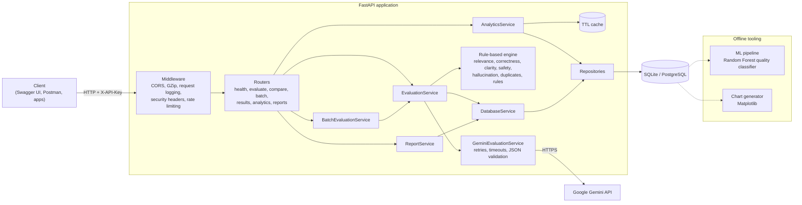
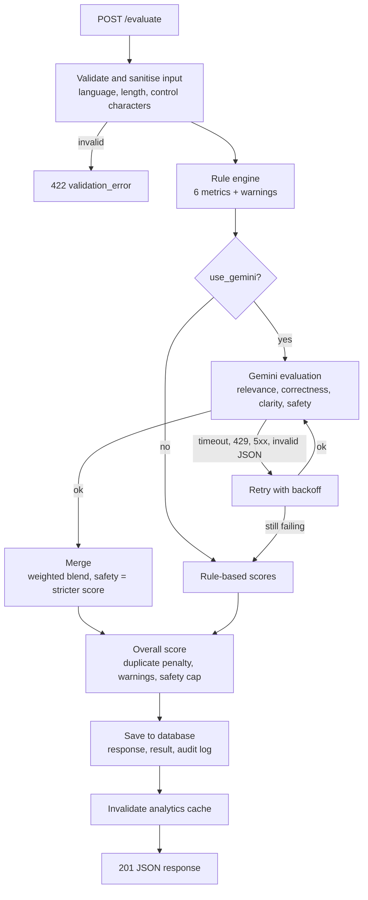
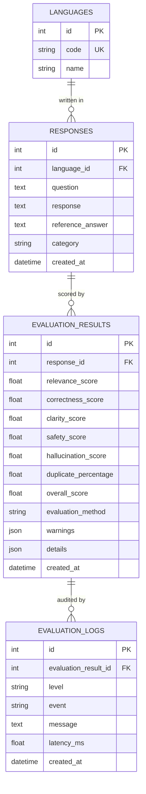

# Architecture

## System architecture

```mermaid
flowchart LR
    Client["Client<br/>(Swagger UI, Postman, apps)"] -->|"HTTP + X-API-Key"| MW

    subgraph API["FastAPI application"]
        MW["Middleware<br/>CORS, GZip, request logging,<br/>security headers, rate limiting"]
        MW --> Routers["Routers<br/>health, evaluate, compare, batch,<br/>results, analytics, reports"]
        Routers --> ES["EvaluationService"]
        Routers --> BS["BatchEvaluationService"]
        Routers --> AS["AnalyticsService"]
        Routers --> RS["ReportService"]
        BS --> ES
        ES --> RULES["Rule-based engine<br/>relevance, correctness, clarity, safety,<br/>hallucination, duplicates, rules"]
        ES --> GS["GeminiEvaluationService<br/>retries, timeouts, JSON validation"]
        ES --> DS["DatabaseService"]
        RS --> DS
        AS --> CACHE[("TTL cache")]
        AS --> REPO
        DS --> REPO["Repositories"]
    end

    GS -->|"HTTPS"| GEMINI["Google Gemini API"]
    REPO --> DB[("SQLite / PostgreSQL")]

    subgraph OFFLINE["Offline tooling"]
        ML["ML pipeline<br/>Random Forest quality classifier"]
        CH["Chart generator<br/>Matplotlib"]
    end
    DB -.-> ML
    DB -.-> CH
```

## Evaluation flow

```mermaid
flowchart TD
    A["POST /evaluate"] --> B["Validate and sanitise input<br/>language, length, control characters"]
    B -->|"invalid"| E1["422 validation_error"]
    B --> C["Rule engine<br/>6 metrics + warnings"]
    C --> D{"use_gemini?"}
    D -->|"no"| H["Rule-based scores"]
    D -->|"yes"| F["Gemini evaluation<br/>relevance, correctness, clarity, safety"]
    F -->|"timeout, 429, 5xx, invalid JSON"| G["Retry with backoff"]
    G -->|"still failing"| H
    G -->|"ok"| F
    F -->|"ok"| M["Merge<br/>weighted blend, safety = stricter score"]
    M --> O["Overall score<br/>duplicate penalty, warnings, safety cap"]
    H --> O
    O --> S["Save to database<br/>response, result, audit log"]
    S --> X["Invalidate analytics cache"]
    X --> R["201 JSON response"]
```

## Database ER diagram

```mermaid
erDiagram
    LANGUAGES ||--o{ RESPONSES : "written in"
    RESPONSES ||--o{ EVALUATION_RESULTS : "scored by"
    EVALUATION_RESULTS ||--o{ EVALUATION_LOGS : "audited by"

    LANGUAGES {
        int id PK
        string code UK
        string name
    }
    RESPONSES {
        int id PK
        int language_id FK
        text question
        text response
        text reference_answer
        string category
        datetime created_at
    }
    EVALUATION_RESULTS {
        int id PK
        int response_id FK
        float relevance_score
        float correctness_score
        float clarity_score
        float safety_score
        float hallucination_score
        float duplicate_percentage
        float overall_score
        string evaluation_method
        json warnings
        json details
        datetime created_at
    }
    EVALUATION_LOGS {
        int id PK
        int evaluation_result_id FK
        string level
        string event
        text message
        float latency_ms
        datetime created_at
    }
```

`evaluation_logs.evaluation_result_id` is nullable: audit rows survive the deletion of their result.
